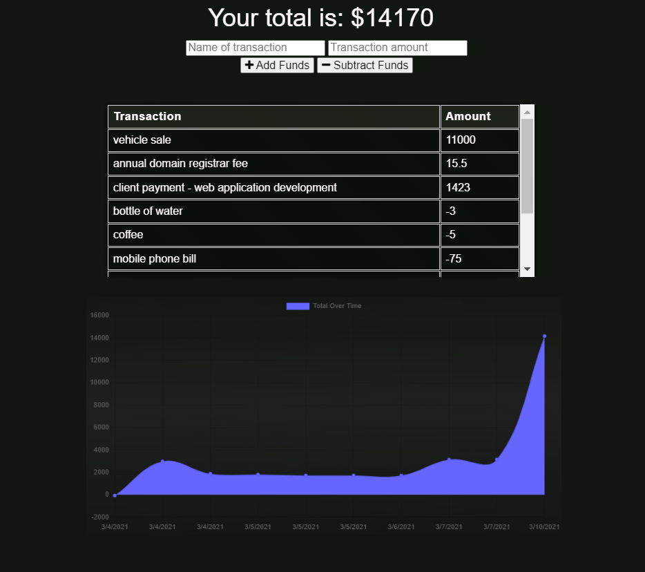

# PWA Budget Tracker


[](/LICENSE)

</div>


<i> Manage your personal finances quickly and effectively. Without a spreadsheet. With or without a reliable connection to the web.
</i>

Heroku installation → https://pwa-budget-tracker-03022021.herokuapp.com/

 .

## Table of Contents

- [Overview](#overview)
- [Getting Started](#getting_started)
- [Usage](#usage)
- [Installation](#installation)
- [Deployment](#deployment)
- [Built Using](#tech_stack)
- [Contributing](../CONTRIBUTING.md)

---
##  Overview <a name = "overview"></a>

PWA Budget Tracker is simple utility for keeping track of your personal finances. In order to provide a seamless online/offline experience, this project utilizes what are known as progressive web application technologies, including service workers and IndexedDB for storing data when if the web client loses it's connection to the web. In today's landscape of increasingly mobile and dispersed technology usage, these types of technologies will surely become a standard that users expect in the near future.

----
##  Getting Started <a name = "getting_started"></a>


In order to use develop this application on your PC, you will need to install Node.JS and Git. clone this project to a location on your file system using the following in your terminal:

```
git clone https://github.com/alane019/pwa-budget-tracker.git
```
This will copy all files from this github repository to your working directory.

----
## Installation  <a name = "installation"></a>

 Install all node package dependencies listed in the package.json file using the following command in your terminal, in the directory of the project:

```
npm install
```
You can also use:

```
npm i
```


----

##  Usage <a name="usage"></a>

When using the PWA Budget Tracker, press the plus sign to add transactions with positive values (that is, credits, or earnings). Use the minus sign to add transactions with negative values (that is, debits, or spending).

----
##  Deployment <a name = "deployment"></a>

Heroku provides a comprehensive set of user documentation to help you host a Node.js application on the web with minimal time and effort: https://devcenter.heroku.com/articles/deploying-nodejs

----

##  Technologies Used  <a name = "tech_stack"></a>
- [NodeJs](https://nodejs.org/) -  JavaScript runtime
- [MongoDB](https://www.mongodb.com/) - Database
- [Mongoose](https://mongoosejs.com/) - Object modeling for MongoDB
- [Express](https://expressjs.com/) - Web server
- [IndexedDB API](https://developer.mozilla.org/en-US/docs/Web/API/IndexedDB_API) used for offline indexed storage
- [Service Worker API](https://developer.mozilla.org/en-US/docs/Web/API/Service_Worker_API) used to handle online/offline data synchronization.

----
##  Contributing <a name = "deployment"></a>

Any and all contributions are welcome. Submit a pull request or an issue if you would like to contribute code changes, or request improvements. This project would be great for any new developers interested in learning how to design or implement progessive web applications.


